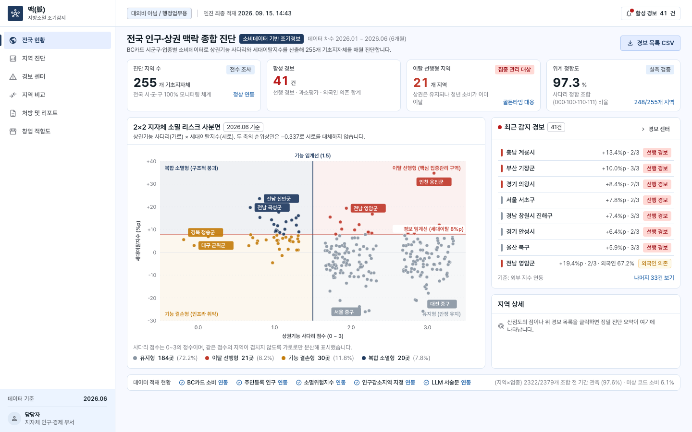
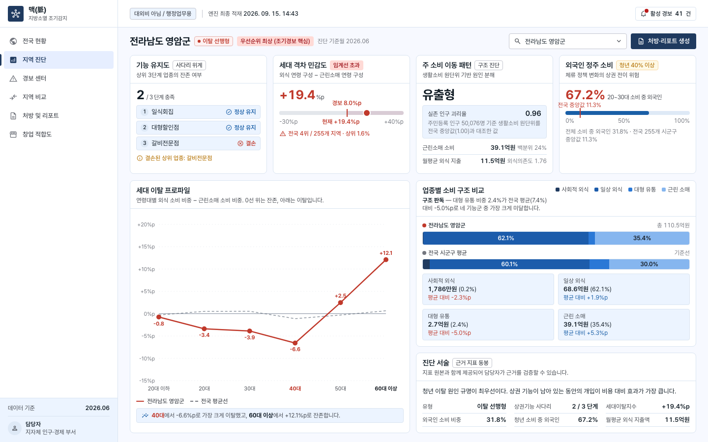
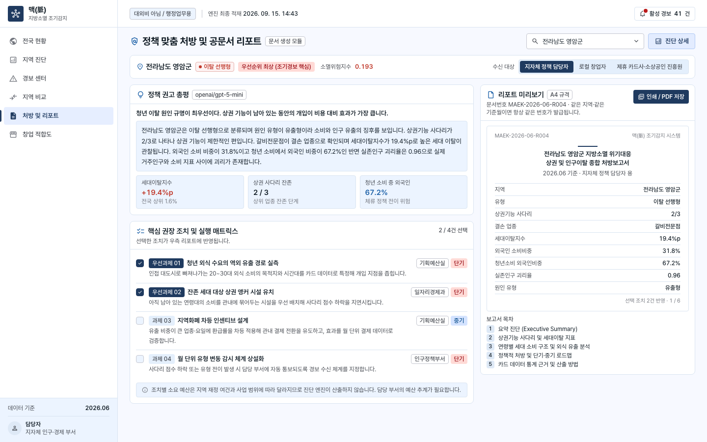
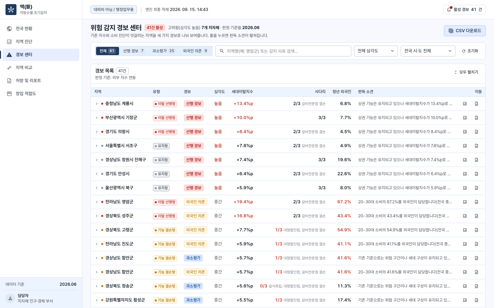
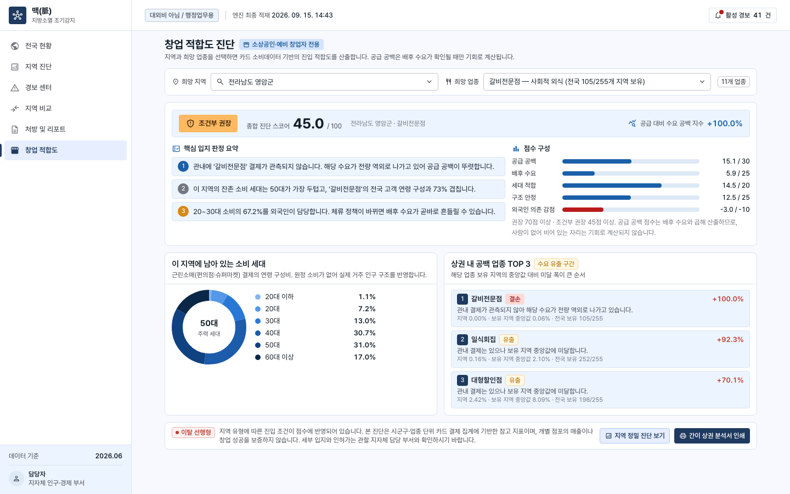

# 맥(脈) — 소비로 먼저 읽는 지방소멸 조기경보

> 사람이 떠난 뒤에 세는 인구 통계 대신, 사람이 떠나기 **전에** 바뀌는 소비를 읽습니다.
> BC카드 시군구·업종별 소비데이터로 전국 255개 기초지자체를 매월 진단하고,
> 기존 지표가 놓치는 지역을 경보로 짚어 주는 서비스입니다.

제1회 AI금융빅데이터플랫폼 소비데이터 활용 분석·아이디어 공모전 출품작의 동작하는 구현체입니다.
242,574행(2026.01~06)의 실제 소비데이터를 읽어 진단하며, 화면의 모든 숫자는 엔진이 계산한 값입니다.



## 왜 소비인가

지방소멸위험지수(20~39세 여성 ÷ 65세 이상)는 주민등록 인구로 계산합니다. 인구는 이미 떠난
결과이고, 등록 주소와 실제 거주가 다르며, 갱신도 느립니다. 소비는 다릅니다.

- **상권 기능이 먼저 무너집니다.** 갈비전문점 → 대형할인점 → 일식회집 순으로 상위 업종이
  사라지는 "사다리"는 인구 감소보다 앞서 관측됩니다.
- **세대 구성이 먼저 바뀝니다.** 외식 결제의 연령 구성과 근린소매(편의점·슈퍼) 결제의 연령
  구성이 벌어지면, 청년이 지역에서 소비하지 않고 밖으로 나가고 있다는 뜻입니다.
- **외국인 의존이 보입니다.** 청년 소비의 절반 이상을 등록 체류 외국인이 담당하는 지역은
  체류 정책 하나로 상권이 흔들립니다. 인구 통계에는 없는 신호입니다.

맥은 이 세 신호를 매월 산출해 지역을 네 유형으로 나누고, 기존 지수와 어긋나는 지역을 경보로 냅니다.

## 무엇을 보여 주는가

| 화면 | 경로 | 하는 일 |
|---|---|---|
| **전국 현황** | `/` | 255곳을 2×2 사분면(상권기능 사다리 × 세대이탈지수)에 놓고, 최근 경보와 데이터 적재 현황을 한 화면에 |
| **지역 진단** | `/regions/:region` | 한 지역의 기능 유지도·세대 격차·원인 분해(공동화/유출/유입)·외국인 정주 소비와 연령별 이탈 프로파일 |
| **경보 센터** | `/alerts` | 선행 경보·과소평가·외국인 의존 세 종류의 경보 목록. 줄을 누르면 판독 소견이 펼쳐지고 CSV 로 내보냅니다 |
| **지역 비교** | `/compare` | 최대 3개 지자체를 같은 눈금의 막대로 나란히. 격차가 큰 항목을 표시 |
| **처방 및 리포트** | `/reports/:region` | 유형별 권장 조치 체크리스트와 A4 공문서 미리보기. 수신 대상(지자체·창업자·카드사)별 서술 |
| **창업 적합도** | `/startup` | 지역 × 희망 업종의 진입 판정. 공급 공백은 배후 수요가 확인될 때만 기회로 계산 |

<table><tr>
<td></td>
<td></td>
</tr><tr>
<td></td>
<td></td>
</tr></table>

## 진단 방법 한눈에

**상권기능 사다리 (0~3점).** 생활 밀착 업종 위계에서 상위 3단계(일식회집 · 대형할인점 ·
갈비전문점)가 남아 있는지 셉니다. 결손된 단계가 곧 "먼저 무너진 기능"입니다.

**세대이탈지수 (%p).** 20~30대 외식 소비 비중 − 20~30대 근린소매 소비 비중. 근린소매는
원정 소비가 없어 실제 거주 구조를 반영하므로, 양수가 크면 청년이 지역 밖에서 소비하고
있다는 신호입니다. 전국 분포 기준 경보선은 +8.0%p 입니다.

**2×2 유형.**

| | 사다리 유지 | 사다리 결손 |
|---|---|---|
| **세대 이탈** | 이탈 선행형 — 상권은 살아 있는데 청년이 먼저 빠짐. 개입 효과가 가장 큰 구간 | 복합 소멸형 — 기능과 세대가 함께 무너짐 |
| **세대 유지** | 유지형 | 기능 결손형 — 사람은 있는데 인프라가 먼저 빠짐 |

**세 가지 경보.** 소멸위험지수가 안전권인데 소비 구조가 이탈이면 **선행 경보**, 지수는
위험인데 상권 기능이 유지되면 **과소평가**(투입 대비 회복 가능성이 높은 지역), 청년 소비 중
외국인 비중이 40% 이상이면 **외국인 의존**. 현재 41건(선행 7 · 과소평가 25 · 외국인 9).

**창업 적합도 (100점).** 공급 공백 · 배후 수요 · 세대 적합 · 구조 안정 · 외국인 의존 감점.
공백 점수는 배후 수요와 곱해 산출하므로 사람이 없어 비어 있는 자리는 기회로 계산되지 않습니다.

## 빠른 시작

두 프로세스를 띄웁니다. 자세한 버전 요구와 문제 해결은 [requirements.md](requirements.md) 에 있습니다.

```bash
# 0. 공모전 제공 데이터를 넣습니다 (저장소에 포함되지 않음)
cp <내려받은>/ABP_CONTEST_DATA.csv data/

# 1. 백엔드 (포트 8000)
cd backend
pip install -r requirements.txt
python3 -m uvicorn api.main:app --port 8000

# 2. 프론트엔드 (포트 5173)
cd frontend
npm ci
npm run dev        # http://localhost:5173
```

프론트의 `/api` 요청은 vite 프록시가 8000번으로 넘기므로 `http://localhost:5173` 만 열면 됩니다.
엔진 적재에 1초쯤 걸리며 그동안 `/api/health` 는 503 을 반환합니다.

**LLM 서술문(선택).** `backend/.env.example` 을 `backend/.env` 로 복사해 `OPENAI_API_KEY` 를
채운 뒤 `curl -X POST http://localhost:8000/api/reload` 를 호출하면 처방 총평을 `gpt-5-mini` 가
씁니다. 키가 없으면 규칙 기반 템플릿으로 자동 폴백하고, 어느 쪽인지 화면 칩에 표시됩니다.

**엔진만 단독 실행.** API 없이 CSV·JSON 산출물만 뽑으려면:

```bash
cd backend
python3 maek_engine.py --card ../data/ABP_CONTEST_DATA.csv --out ./output --no-llm
```

## 구조

```
backend/            Analytics Engine + Service Layer
  maek_engine.py      ①수집 ②정제 ③지표 ④유형판정 ⑤경보 ⑥리포트 ⑦배포 + 창업 적합도
  api/                FastAPI. 기동 시 엔진을 한 번 돌려 메모리에 들고 조회만 시킴
  maek_analysis.ipynb 제안서 작성 시 사용한 탐색적 분석 기록
frontend/           Presentation Layer (React 18 + Vite 5 + Tailwind 3, 차트는 SVG 직접 작성)
  src/pages/          화면 6개      src/charts/  사분면·프로파일·게이지
  design_ref/         디자인 토큰(DESIGN.md)과 Stitch 원안
data/               원천 데이터와 스키마 안내 (data/README.md)
docs/screens/       1440×900 화면 캡처
requirements.md     실행 환경·의존성·문제 해결
```

데이터 흐름은 한 방향입니다. 소비데이터 CSV → 정제(결측을 신호로 취급) → 지역×업종 지표 →
유형 판정 → 외부 지수 대조 경보 → 서술문·처방 → API → 화면. 전 공정이 1초 안에 끝나 월별
데이터 교체 후 `POST /api/reload` 한 번으로 갱신됩니다.

## 데이터 원천

| 원천 | 상태 | 용도 |
|---|---|---|
| BC카드 시군구·업종별 소비데이터 (공모전 제공) | **필수** · 직접 배치 | 모든 지표의 바탕 |
| 행안부 주민등록 인구통계 2026-06 | 포함 | 생활소비 원단위, 실존 인구 괴리율, 원인 분해 |
| 지방소멸위험지수 (같은 인구 자료로 고용정보원 산식 적용) | 포함 | 선행 경보·과소평가 판정의 대조 기준 |
| 행안부 인구감소지역 지정 현황 89곳 | 포함 | 지정 여부 대조, 미지정 우선 검토 대상 |
| OpenAI (gpt-5-mini) | 선택 · 키 필요 | 진단 서술문. 없으면 템플릿 |

선택 원천이 없으면 해당 지표를 추정하지 않고 화면에 "미연동"으로 표시합니다. 출처와 갱신
방법은 [data/README.md](data/README.md) 를 보세요.

## API

`http://localhost:8000/docs` 에서 스키마를 볼 수 있습니다.

| 엔드포인트 | 용도 |
|---|---|
| `GET /api/health` | 적재 상태와 원천 연동 여부 |
| `GET /api/national/summary` | KPI·유형 분포·데이터 감사 |
| `GET /api/national/matrix` | 2×2 산점도용 255개 좌표 |
| `GET /api/national/regions` | 유형별 지역 목록 |
| `GET /api/regions?q=` | 지역 검색 |
| `GET /api/regions/{region}` | 단일 지역 정밀 진단 |
| `GET /api/regions/compare?regions=` | 2~3개 지역 교차 진단 |
| `GET /api/alerts?kind=&severity=&sido=&q=` | 경보 목록 |
| `GET /api/alerts/export.csv` | 경보 CSV (엑셀용 BOM 포함) |
| `GET /api/startup/businesses` | 업종 목록 |
| `GET /api/startup/assess?region=&business=` | 창업 적합도 판정 |
| `GET /api/reports/{region}?audience=` | 처방·리포트 묶음 |
| `POST /api/reload` | 데이터·키 교체 후 재적재 |

## 설계에서 지킨 것

- **비어 있으면 비었다고 말합니다.** 없는 데이터를 추정해 채우지 않습니다.
- **서술문에는 근거 지표를 동봉합니다.** LLM 이 쓰든 템플릿이 쓰든 응답에 지표 원본과
  생성 출처가 실려 담당자가 검증할 수 있습니다.
- **조치별 예산은 산출하지 않습니다.** 지역 재정과 사업 범위에 좌우되는 값이라 엔진이 만들
  근거가 없습니다. 과제·담당 기능·시기 구간까지만 제시합니다.
- **화면은 한 화면에 들어옵니다.** 1440×900 에서 각 화면의 핵심이 스크롤 없이 읽히도록
  밀도를 잡았고, 흰 바탕·중성 회색 경계선·본문 4.5:1 이상 대비를 지킵니다. 디자인 토큰과
  근거는 [frontend/design_ref/stitch_/DESIGN.md](frontend/design_ref/stitch_/DESIGN.md) 에 있습니다.

## 저장소에 없는 것

- `data/ABP_CONTEST_DATA.csv` — 공모전 제공 데이터. 재배포 조건에 따라 직접 배치합니다.
- `backend/.env` — API 키. `.env.example` 을 복사해 만듭니다.
- 공모전 제출 서류.
